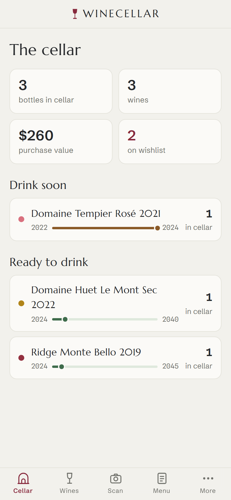
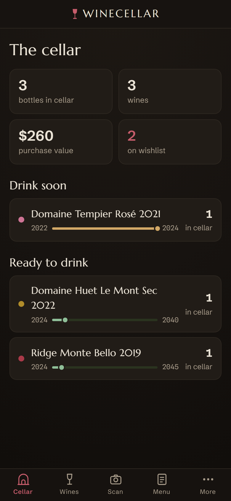
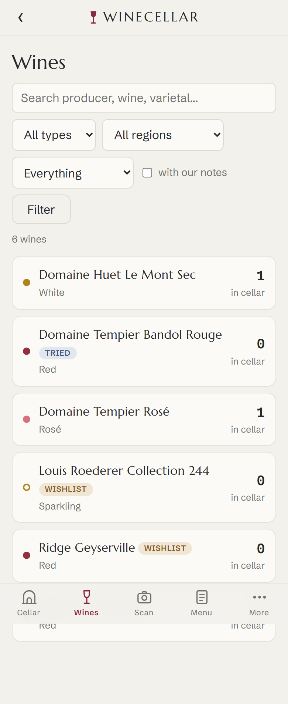
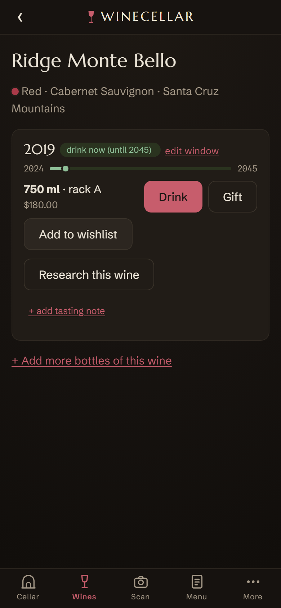

# Winecellar design system — "Cellar book"

The app's visual identity, shipped 2026-07-16. One idea: a sommelier's cellar
book — engraved estate type, ledger numerals, and the colors of wine itself.
Designed **dark-first** (a cellar is dark; the app gets used in dim restaurants
and at the rack); light mode is the tasting sheet.

Dark is **"the lodge"**: chalk on old oak with a lamplight vignette, after the
Cockburn's port lodges in Porto (the owner's reference, 2026-07-16 — it replaced an
earlier cool-slate ground that read as generic near-black). It is dark *umber*,
deliberately not barrel-brown: the ground sits just outside the wine gamut so
the straw dots and tawny gauges stay legible — any lighter/browner and they
dissolve (measured; dots revalidated against `#211C17`, same results as slate,
garnet WARN 2.74 with the always-present type word as relief).

## The book — reference plates

Committed renders of the shipped identity (iPhone size, seeded demo data).
When restyling, compare against these before and after; regenerate via the
workflow at the bottom of this doc.

| | |
|---|---|
|  |  |
|  |  |

## Grounds

| Token | Light ("tasting sheet") | Dark ("the lodge") |
|---|---|---|
| `--bg` | `#F2F1EC` cool bone (deliberately not warm cream) | `#171310` dark umber + fixed radial vignette (`body::before`) |
| `--surface` | `#FBFAF7` | `#211C17` |
| `--surface-alt` | `#E9E8E1` | `#2C2620` |
| `--ink` | `#26282B` graphite | `#ECE5D8` **chalk** (chalk-on-oak is the dark identity) |
| `--accent` | `#87293C` garnet | `#C75D6C` |

Garnet is **reserved** — primary buttons, active tab, links. Never paint
(the old solid-red header is gone on purpose). Housekeeping actions (filter)
stay ghost-styled.

Status is subject-true: ready = moss, hold = cellar blue, **past = tawny**
(a wine past its window goes tawny — the color tells the truth).

## Type — three voices

| Face | File | Role |
|---|---|---|
| **Marcellus** (single weight — enforces restraint) | `static/fonts/marcellus-400.woff2` | Wordmark, headings, wine names |
| **Schibsted Grotesk** (variable 400–700) | `schibsted-var.woff2` | All UI and body text |
| **Spline Sans Mono** (variable 400–600) | `splinemono-var.woff2` | **Data**: vintage years, window years, prices, counts (`.num`, `.card-side strong`, gauge labels, table cells) |

The mono-set numbers are the ledger texture. Self-hosted woff2, latin subset,
~98 KB total; preloaded in `base.html`.

## Components

### Glass dot (`.dot .dot-<wine_type>`)
Wine type as the color of the wine in the glass. **Validated** with the dataviz
palette checker (all-pairs CVD + normal-vision + contrast) on both surfaces:

- light: garnet `#93303F` · straw `#B08419` · rosé `#D9707E` — all PASS
- dark: garnet `#AA3A49` · straw `#B08C2A` · rosé `#CE7495` — PASS (one WARN:
  garnet contrast 2.66 vs surface — legal because the type word is always
  printed beside the dot; identity never rides on color alone)

Wine's natural gamut cannot support 6 distinguishable hues (red vs tawny vs
amber all collide under CVD — measured, not guessed), so: **red family**
(red, fortified) = garnet fill, **white family** (white, dessert) = straw fill,
**rosé** = pink fill, **sparkling = hollow ring** (shape, not hue). Do not add
more dot hues; the printed type word carries exact identity.

### Window gauge (`templates/cellar/_gauge.html`) — the signature
The vintage's drinking window as a timeline: mono year labels at the ends,
fill = share of the window elapsed, ringed tick = now, color = status
(track is the soft step of the same status ramp, per dataviz meter rules).
Powered by `Vintage.window_progress` (0–100, None without a complete window).
Used on dashboard rows and wine-detail vintage sections. `role="img"` with a
spoken aria-label.

### Dataviz rules honored
Stat-tile values wear **ink**, never the accent (exception: a tile that is
a link may use accent as the affordance). Numbers in tables are tabular;
big standalone values are proportional. Status colors never double as
series colors.

## Tab bar
Five inline SVG stroke icons in `base.html` (cellar arch, wine glass, camera,
menu card, dots) — emojis looked platform-dependent and undesigned. The
five-tab cap and drawer decision are in CLAUDE.md.

## Reviewing changes
Seed variety data (`scripts/dev/seed_smoke_data.py` — includes white/rosé/
sparkling + a past-window wine to exercise dots and gauge states), run the
server on a free port (foundation may own :8000 on the desktop), then:

```powershell
$env:WINECELLAR_BASE = "http://127.0.0.1:8123"
.venv\Scripts\python.exe scripts\dev\screenshot_pages.py        # light
.venv\Scripts\python.exe scripts\dev\screenshot_pages.py --dark # dark
```

PNGs land in `logs/screenshots/`. Check both themes — dark is the primary
identity, light must hold up on its own.
